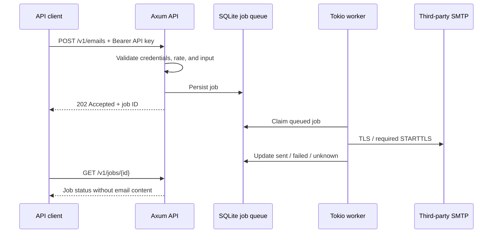

# Courier Hub

**English** | [繁體中文](README.zh-TW.md)

An asynchronous REST API relay built with Rust, Axum, and Tokio. The first version sends plain-text email through a third-party SMTP server, such as Gmail or the provider hosting your domain's mailboxes. It does not run a mail server or receive incoming SMTP mail.

## How it works



`202` means the job is stored in the queue; it has not necessarily been sent. `sent` means the SMTP server accepted the message, not that it reached the recipient's inbox. The mail provider handles final delivery, bounces, and spam filtering.

## Rust concepts for developers new to Rust

You can get started with experience in another language; you do not need to learn all of Rust first.

| Concept | Use in this project | Familiar equivalent |
| --- | --- | --- |
| `struct` | Data structures such as `Email` and `Config` | DTO / the data portion of a class |
| `trait` | `DeliveryTransport` defines the delivery contract | Interface / protocol |
| `impl` | `SmtpTransport` implements that contract | Implements an interface |
| `async` / `.await` | Wait for network and database operations without blocking a thread | Async / await |
| `Result<T, E>` | A success value or an error the caller must handle | A discriminated success/error union |
| `Arc` | Share resources between API requests and workers | A reference-counted shared object |
| `Send + Sync` | Require delivery implementations to be safe to use across threads | A thread-safety contract |
| Cargo | Manage dependencies, builds, tests, and tools | npm / dotnet CLI / Maven |

The trait separates the worker from SMTP details. `DeliveryTransport::deliver` currently accepts a typed `Email`, allowing another email provider or a fake implementation for tests. Future webhook or file relay features will need their own DTOs, API routes, and versioned job formats. A trait does not automatically make arbitrary payloads suitable for the same interface.

## Quick start

### 1. Install and build

Use the [official Rust installer](https://rust-lang.org/tools/install/) with Rust 1.88 or newer. On Windows, use the MSVC toolchain and install Visual Studio Build Tools with the "Desktop development with C++" workload. Linux and macOS need a C/C++ compiler. The project uses rustls, so OpenSSL is not required to build the service; SQLite is compiled with the Rust dependencies. `rust-toolchain.toml` selects 1.88.0. If needed, rustup downloads that version plus rustfmt and Clippy without changing other projects' default toolchain.

```sh
cargo build --locked
```

Keep `Cargo.lock` in Git so machines use the same dependency versions. It contains dependency metadata, not credentials.

### 2. Create private configuration

Windows PowerShell:

```powershell
Copy-Item .env.example .env
$keyBytes = New-Object byte[] 32
$rng = [System.Security.Cryptography.RandomNumberGenerator]::Create()
$rng.GetBytes($keyBytes)
$rng.Dispose()
$apiKey = [BitConverter]::ToString($keyBytes).Replace('-', '').ToLowerInvariant()
# Display locally only. Set API_KEY in .env to this value.
$apiKey
notepad .env
```

Linux/macOS:

```sh
cp .env.example .env
chmod 600 .env
# Set API_KEY in .env to the output.
openssl rand -hex 32
```

Set `API_KEY`, `SMTP_HOST`, `SMTP_USERNAME`, `SMTP_PASSWORD`, and `SMTP_FROM`. The example does not contain a usable account, and the `REPLACE_` API key placeholder is rejected. Quote passwords containing special characters according to dotenv syntax. Do not paste `.env` contents into issues, chats, screenshots, or CI logs.

Only `.env` in the current working directory is read; parent directories are not searched. Existing process environment variables take precedence. Production deployments can omit `.env` and inject environment variables through a service manager or secret manager.

### 3. Start the service

```sh
cargo run --locked
```

The default listener is `127.0.0.1:8080`. For production, run `cargo build --release --locked`, then execute `target/release/courier-hub.exe` on Windows or `target/release/courier-hub` on Linux/macOS. Build for each target platform; a Windows executable does not run directly on Linux.

The GitHub Actions test matrix covers Windows, Linux, and macOS; local verification was performed on Windows. Startup creates a private `data/` directory and SQLite database. Ctrl+C stops new work and waits for the current delivery attempts to finish; Unix also handles SIGTERM.

### 4. Call the API

Use the same API key in a separate PowerShell window. You can reuse the previously generated `$apiKey` or set `COURIER_API_KEY` in your client's private environment. Loading `.env` in the service does not set environment variables in another window.

```powershell
$apiKey = $env:COURIER_API_KEY
$headers = @{
    Authorization = "Bearer $apiKey"
    'Idempotency-Key' = [Guid]::NewGuid().ToString()
}
$body = @{
    to = @('recipient@example.com')
    subject = 'Asynchronous email test'
    text = 'This message was relayed by Courier Hub.'
} | ConvertTo-Json
$job = Invoke-RestMethod -Method Post -Uri 'http://127.0.0.1:8080/v1/emails' `
    -Headers $headers -ContentType 'application/json; charset=utf-8' `
    -Body ([System.Text.Encoding]::UTF8.GetBytes($body))
$job
Invoke-RestMethod -Uri "http://127.0.0.1:8080/v1/jobs/$($job.id)" -Headers $headers
```

Linux/macOS (`COURIER_API_KEY` comes from your client's private configuration):

```sh
curl -i http://127.0.0.1:8080/v1/emails \
  -H "Authorization: Bearer $COURIER_API_KEY" \
  -H 'Content-Type: application/json' \
  -H 'Idempotency-Key: example-request-001' \
  --data '{"to":["recipient@example.com"],"subject":"Hello","text":"Hello from Courier Hub"}'

curl http://127.0.0.1:8080/v1/jobs/WORK_ID \
  -H "Authorization: Bearer $COURIER_API_KEY"
```

Use a new `Idempotency-Key` for each new job. When resubmitting the same job after a network error, keep the original key and the same JSON field values. The fixed key above is only an example.

## SMTP setup

### Gmail

```dotenv
SMTP_HOST=smtp.gmail.com
SMTP_PORT=587
SMTP_TLS=starttls
SMTP_USERNAME=your-account@gmail.com
SMTP_PASSWORD=REPLACE_WITH_GOOGLE_APP_PASSWORD
SMTP_FROM=your-account@gmail.com
```

Use an account authorized to send mail and a Google app password, not your Google sign-in password. App passwords require 2-Step Verification and may be unavailable for some organizational accounts, security-key configurations, or accounts enrolled in Advanced Protection. Changing your Google password may require generating a new app password. See [Google's official instructions](https://support.google.com/accounts/answer/185833).

This version supports SMTP username/password authentication and does not implement OAuth2. If your account policy requires OAuth2, that account cannot be used directly with this version. Use a provider that permits SMTP app passwords or add an OAuth2 adapter later.

### A mailbox on your own domain

```dotenv
SMTP_HOST=smtp.your-mail-provider.example
SMTP_PORT=465
SMTP_TLS=implicit
SMTP_USERNAME=notifications@your-domain.example
SMTP_PASSWORD=REPLACE_WITH_PROVIDER_SMTP_PASSWORD
SMTP_FROM=notifications@your-domain.example
```

Owning a domain does not provide a mail service by itself. Use the SMTP host, authentication method, and sender address specified by your mailbox hosting provider. The provider's settings are authoritative. If it requires port 587 with STARTTLS, use `SMTP_TLS=starttls`. `SMTP_FROM` is fixed in server configuration; API callers cannot choose or spoof the sender.

`starttls` must successfully upgrade to TLS before sending credentials or email. `implicit` uses TLS from the start of the connection. Both validate the hostname and public CA certificate chain. Plaintext SMTP and disabling certificate validation are not supported. See the [lettre documentation](https://docs.rs/lettre/latest/lettre/transport/smtp/struct.AsyncSmtpTransport.html).

## API contract

The full specification is in [docs/openapi.yaml](docs/openapi.yaml) and can be imported into tools supporting OpenAPI 3.0.

| Method | Path | Purpose | Authentication |
| --- | --- | --- | --- |
| GET | `/healthz` | Check API/database availability, not SMTP | None |
| POST | `/v1/emails` | Submit email; return 202, a job ID, and Location | Bearer API key |
| GET | `/v1/jobs/{id}` | Query delivery status | Bearer API key |

Submission JSON permits only `to`, `subject`, and `text`. Extra fields are rejected. Attachments, HTML, CC/BCC, and incoming mail are not supported in this version.

| Field | Limit |
| --- | --- |
| `to` | 1–10 bare email addresses, at most 254 bytes each; no display names |
| `subject` | Nonblank, at most 998 bytes; no control characters, including CR/LF |
| `text` | Nonblank, at most 48 KiB; no NUL characters |
| HTTP JSON | At most 64 KiB, including JSON encoding overhead |
| `Idempotency-Key` | Optional; 1–128 ASCII characters, limited to letters, digits, and `-_.:` |

`created_at` and `updated_at` are UTC Unix seconds. Example job response:

```json
{
  "id": "38af9c6e-930c-4d71-8f6c-7ee385bc84c8",
  "status": "queued",
  "created_at": 1791504000,
  "updated_at": 1791504000,
  "error_code": null
}
```

| Status | Meaning |
| --- | --- |
| `queued` | Persisted and waiting for a worker |
| `sending` | An SMTP delivery attempt is in progress |
| `sent` | SMTP accepted the message |
| `failed` | SMTP explicitly rejected it (`smtp_rejected`), or local message construction failed (`invalid_message`) |
| `unknown` | SMTP acceptance is uncertain (`delivery_uncertain`), or startup detected an interrupted attempt (`interrupted`) |

The same key and content return the original job, with status 202 even if completed. The same key with different content returns 409. Removing an expired job also removes its key, so deduplication applies only within the retention period. Repeated POST requests without a key create separate jobs.

Other response codes: 400 for invalid keys, job IDs, or malformed JSON; 401 for invalid credentials; 404 for missing or expired jobs; 405 for unsupported methods; 413 for oversized requests; 415 for invalid Content-Type; 422 for invalid fields; 429 for rate limits; and 503 for a full queue or failed health check. Requests timing out return 408; database errors return 500. Error format:

```json
{"error":{"code":"unauthorized","message":"valid Bearer API key required"}}
```

## Configuration

| Environment variable | Default / range |
| --- | --- |
| `API_KEY` | Required; 32–256 printable ASCII characters without whitespace. Generate a hex value from 32 random bytes. |
| `BIND_ADDR` | `127.0.0.1:8080`, IP:port |
| `DATA_DIR` | `data`, a private local data directory |
| `SMTP_HOST` | Required; SMTP DNS hostname |
| `SMTP_PORT` | 587 for STARTTLS or 465 for implicit TLS by default; 1–65535 |
| `SMTP_TLS` | `starttls` or `implicit` |
| `SMTP_USERNAME` / `SMTP_PASSWORD` | Required; never supplied through the API |
| `SMTP_FROM` | Required; a bare address or `Courier Hub <sender@example.com>` |
| `SMTP_TIMEOUT_SECONDS` | 30; 1–120. Limits both SMTP commands and the entire delivery attempt. |
| `WORKER_CONCURRENCY` | 2; 1–16 |
| `MAX_PENDING_JOBS` | 1000; 1–100000, counting queued + sending jobs |
| `REQUESTS_PER_MINUTE` | 120; 1–100000. A service-wide token bucket for the single API key; permits an initial burst of that size, then refills continuously. |
| `JOB_RETENTION_HOURS` | 24; 1–720. Retains terminal job status and keys; cleanup runs at startup and every minute. |
| `ALLOWED_RECIPIENT_DOMAINS` | Empty allows all domains. Otherwise, comma-separated exact domains; subdomains are not included. |

Polling and submissions share the rate budget; `/healthz` is excluded. Restart the process after changing SMTP credentials or the API key.

## Security and privacy

- The API key is mandatory. Authentication uses a hash and constant-time comparison. All job submissions and status queries require authentication.
- The default listener is local only. For access from other machines, deploy behind an HTTPS reverse proxy or API gateway and adjust `BIND_ADDR` for your environment. The service itself uses HTTP; SMTP TLS does not encrypt the HTTP API.
- Request bodies, message text, recipient counts, queue capacity, delivery concurrency, and authenticated request rates are bounded. Use a gateway to control public connections and unauthenticated traffic; application rate limits do not provide DDoS protection.
- CORS is not enabled. Browser clients needing cross-origin access should use an authenticated backend proxy. Do not expose the API key in a public frontend.
- The API does not accept SMTP hosts, credentials, sender addresses, or arbitrary relay URLs. Callers cannot choose internal network destinations. Set `ALLOWED_RECIPIENT_DOMAINS` to restrict recipients.
- Application logs include only job IDs, statuses, and generic errors. They do not include API keys, SMTP credentials, addresses, subjects, message bodies, or raw provider errors.
- SQLite persists recipients, subjects, and bodies for pending jobs as plaintext on disk. Terminal jobs have their payload set to NULL. This is not secure physical erasure: WAL files, disk remnants, and backups may retain earlier data. Provide disk and backup encryption through your deployment environment if required.
- Database and lock files use mode 0600 on Unix. Windows inherits the data directory's ACL; give only the service account the necessary access. Restrict access to `.env`, data directories, and backups.
- `.gitignore` excludes `.env`, `.env.*` except the secret-free `.env.example`, `data/`, SQLite/WAL files, private key/certificate files, and logs. Put custom data directories outside the repository or add them to your ignore rules.
- `.gitignore` does not remove already tracked secrets or prevent `git add -f`. No real credentials were added to this new project. If a secret is committed later, revoke or rotate it first, then address Git history.

Before committing, check:

```sh
git check-ignore .env .env.production data/courier.db data/courier.db-wal
git status --short
```

This version uses one process, one SMTP configuration, and one shared API key, without multi-tenant authorization. A cross-platform file lock prevents two instances from using the same `DATA_DIR`. Keep SQLite on a local persistent disk. Horizontal scaling will require a shared database or message queue and worker leases.

SMTP provides no end-to-end exactly-once guarantee. This version does not automatically retry delivery, even after an explicit rejection. For `unknown` jobs, check the provider's delivery records before deciding to submit again with a new key. The stable Message-ID helps investigation but does not guarantee provider deduplication.

## Development and verification

```sh
cargo fmt --all -- --check
cargo test --locked --all-targets
cargo clippy --locked --all-targets -- -D warnings
cargo build --locked --release
```

Tests use temporary SQLite databases, fake delivery implementations, and local TLS SMTP endpoints. They need no real credentials and send no external email. Coverage includes authentication and rate limits, input injection, queue capacity, concurrent deduplication, restart recovery, status privacy, retention, SMTP acceptance/rejection, and prevention of TLS downgrade. Verify real account permissions, provider quotas, and delivery using your own test mailbox after supplying private configuration.

CI builds and runs tests, rustfmt, and Clippy on all three platforms. A separate RustSec cargo-audit job checks public dependencies for known vulnerabilities. These checks do not need SMTP secrets.

| File | Responsibility |
| --- | --- |
| `src/main.rs` | Startup, background tasks, and shutdown |
| `src/config.rs` | Private environment configuration and startup validation |
| `src/api.rs` | HTTP routes, authentication, rate limits, and error responses |
| `src/model.rs` | Email/job contracts and validation |
| `src/store.rs` | Durable SQLite jobs, capacity, and deduplication |
| `src/transport.rs` | Delivery trait and SMTP adapter |
| `src/worker.rs` | Asynchronous job execution and delivery timeouts |
| `tests/service.rs` | Service tests independent of external providers |
