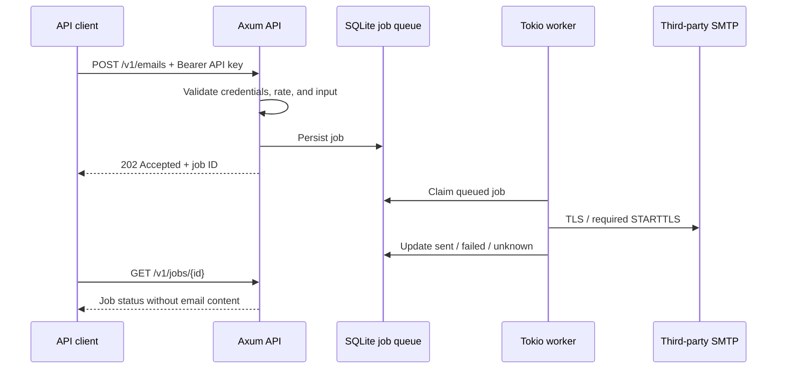

# Courier Hub

**English** | [繁體中文](README.zh-TW.md)

An asynchronous REST API relay built with Rust, Axum, and Tokio. The first version sends plain-text email through a third-party SMTP server, such as Gmail or the provider hosting your domain's mailboxes. It does not run a mail server or receive incoming SMTP mail.

## How it works



`202` means the job is stored in the queue; it has not necessarily been sent. `sent` means the SMTP server accepted the message, not that it reached the recipient's inbox. The mail provider handles final delivery, bounces, and spam filtering.

## Rust concepts for developers new to Rust

You can get started with experience in another language; you do not need to learn all of Rust first.

| Concept | Use in this project | Familiar equivalent |
| --- | --- | --- |
| `struct` | Data structures such as `Email` and `Config` | DTO / the data portion of a class |
| `trait` | `DeliveryTransport` defines the delivery contract | Interface / protocol |
| `impl` | `SmtpTransport` implements that contract | Implements an interface |
| `async` / `.await` | Wait for network and database operations without blocking a thread | Async / await |
| `Result<T, E>` | A success value or an error the caller must handle | A discriminated success/error union |
| `Arc` | Share resources between API requests and workers | A reference-counted shared object |
| `Send + Sync` | Require delivery implementations to be safe to use across threads | A thread-safety contract |
| Cargo | Manage dependencies, builds, tests, and tools | npm / dotnet CLI / Maven |

The trait separates the worker from SMTP details. `DeliveryTransport::deliver` currently accepts a typed `Email`, allowing another email provider or a fake implementation for tests. Future webhook or file relay features will need their own DTOs, API routes, and versioned job formats. A trait does not automatically make arbitrary payloads suitable for the same interface.

## Quick start

### 1. Install and build

Use the [official Rust installer](https://rust-lang.org/tools/install/) with Rust 1.88 or newer. On Windows, use the MSVC toolchain and install Visual Studio Build Tools with the "Desktop development with C++" workload. Linux and macOS need a C/C++ compiler. The project uses rustls, so OpenSSL is not required to build the service; SQLite is compiled with the Rust dependencies. `rust-toolchain.toml` selects 1.88.0. If needed, rustup downloads that version plus rustfmt and Clippy without changing other projects' default toolchain.

```sh
cargo build --locked
```

Keep `Cargo.lock` in Git so machines use the same dependency versions. It contains dependency metadata, not credentials.

### 2. Create private configuration

Windows PowerShell:

```powershell
Copy-Item .env.example .env
$keyBytes = New-Object byte[] 32
$rng = [System.Security.Cryptography.RandomNumberGenerator]::Create()
$rng.GetBytes($keyBytes)
$rng.Dispose()
$apiKey = [BitConverter]::ToString($keyBytes).Replace('-', '').ToLowerInvariant()
# Display locally only. Set API_KEY in .env to this value.
$apiKey
notepad .env
```

Linux/macOS:

```sh
cp .env.example .env
chmod 600 .env
# Set API_KEY in .env to the output.
openssl rand -hex 32
```

Set `API_KEY`, `SMTP_HOST`, `SMTP_USERNAME`, `SMTP_PASSWORD`, and `SMTP_FROM`. The example does not contain a usable account, and the `REPLACE_` API key placeholder is rejected. Quote passwords containing special characters according to dotenv syntax. Do not paste `.env` contents into issues, chats, screenshots, or CI logs.

Only `.env` in the current working directory is read; parent directories are not searched. Existing process environment variables take precedence. Production deployments can omit `.env` and inject environment variables through a service manager or secret manager.

### 3. Start the service

```sh
cargo run --locked
```

The default listener is `127.0.0.1:8080`. For production, run `cargo build --release --locked`, then execute `target/release/courier-hub.exe` on Windows or `target/release/courier-hub` on Linux/macOS. Build for each target platform; a Windows executable does not run directly on Linux.

The GitHub Actions test matrix covers Windows, Linux, and macOS; local verification was performed on Windows. Startup creates a private `data/` directory and SQLite database. Ctrl+C stops new work and waits for the current delivery attempts to finish; Unix also handles SIGTERM.

### 4. Call the API

Use the same API key in a separate PowerShell window. You can reuse the previously generated `$apiKey` or set `COURIER_API_KEY` in your client's private environment. Loading `.env` in the service does not set environment variables in another window.

```powershell
$apiKey = $env:COURIER_API_KEY
$headers = @{
    Authorization = "Bearer $apiKey"
    'Idempotency-Key' = [Guid]::NewGuid().ToString()
}
$body = @{
    to = @('recipient@example.com')
    subject = 'Asynchronous email test'
    text = 'This message was relayed by Courier Hub.'
} | ConvertTo-Json
$job = Invoke-RestMethod -Method Post -Uri 'http://127.0.0.1:8080/v1/emails' `
    -Headers $headers -ContentType 'application/json; charset=utf-8' `
    -Body ([System.Text.Encoding]::UTF8.GetBytes($body))
$job
Invoke-RestMethod -Uri "http://127.0.0.1:8080/v1/jobs/$($job.id)" -Headers $headers
```

Linux/macOS (`COURIER_API_KEY` comes from your client's private configuration):

```sh
curl -i http://127.0.0.1:8080/v1/emails \
  -H "Authorization: Bearer $COURIER_API_KEY" \
  -H 'Content-Type: application/json' \
  -H 'Idempotency-Key: example-request-001' \
  --data '{"to":["recipient@example.com"],"subject":"Hello","text":"Hello from Courier Hub"}'

curl http://127.0.0.1:8080/v1/jobs/WORK_ID \
  -H "Authorization: Bearer $COURIER_API_KEY"
```

Use a new `Idempotency-Key` for each new job. When resubmitting the same job after a network error, keep the original key and the same JSON field values. The fixed key above is only an example.

## SMTP setup

### Gmail

```dotenv
SMTP_HOST=smtp.gmail.com
SMTP_PORT=587
SMTP_TLS=starttls
SMTP_USERNAME=your-account@gmail.com
SMTP_PASSWORD=REPLACE_WITH_GOOGLE_APP_PASSWORD
SMTP_FROM=your-account@gmail.com
```

Use an account authorized to send mail and a Google app password, not your Google sign-in password. App passwords require 2-Step Verification and may be unavailable for some organizational accounts, security-key configurations, or accounts enrolled in Advanced Protection. Changing your Google password may require generating a new app password. See [Google's official instructions](https://support.google.com/accounts/answer/185833).

This version supports SMTP username/password authentication and does not implement OAuth2. If your account policy requires OAuth2, that account cannot be used directly with this version. Use a provider that permits SMTP app passwords or add an OAuth2 adapter later.

### A mailbox on your own domain

```dotenv
SMTP_HOST=smtp.your-mail-provider.example
SMTP_PORT=465
SMTP_TLS=implicit
SMTP_USERNAME=notifications@your-domain.example
SMTP_PASSWORD=REPLACE_WITH_PROVIDER_SMTP_PASSWORD
SMTP_FROM=notifications@your-domain.example
```

Owning a domain does not provide a mail service by itself. Use the SMTP host, authentication method, and sender address specified by your mailbox hosting provider. The provider's settings are authoritative. If it requires port 587 with STARTTLS, use `SMTP_TLS=starttls`. `SMTP_FROM` is fixed in server configuration; API callers cannot choose or spoof the sender.

`starttls` must successfully upgrade to TLS before sending credentials or email. `implicit` uses TLS from the start of the connection. Both validate the hostname and public CA certificate chain. Plaintext SMTP and disabling certificate validation are not supported. See the [lettre documentation](https://docs.rs/lettre/latest/lettre/transport/smtp/struct.AsyncSmtpTransport.html).

### Gandi Mail

Use these settings only when **Gandi Mail hosts the mailbox**. Registering a domain at Gandi does not determine who hosts its email. You need an active mailbox, its full email address as the username, and its mailbox password, rather than your Gandi account password or API key. A forwarding address alone is not a mailbox. See [Gandi's email settings](https://docs.gandi.net/en/gandimail/standard_email_settings/) and [mailbox/forwarding FAQ](https://docs.gandi.net/en/gandimail/faq/general_questions.html).

```ini
SMTP_HOST=mail.gandi.net
SMTP_PORT=465
SMTP_TLS=implicit
SMTP_USERNAME=notifications@your-domain.example
SMTP_PASSWORD="REPLACE_WITH_NEW_MAILBOX_PASSWORD"
SMTP_FROM="Courier Hub <notifications@your-domain.example>"
```

Alternatively, keep the same host and credentials and change **both** settings:

```ini
SMTP_PORT=587
SMTP_TLS=starttls
```

| Setting | Correct pairing / meaning |
| --- | --- |
| `mail.gandi.net`, 465, `implicit` | TLS starts immediately when connecting |
| `mail.gandi.net`, 587, `starttls` | SMTP must upgrade to TLS before authentication |
| 465 with `starttls` | Incorrect pairing; can cause a timeout or handshake failure |
| `smtpout.secureserver.net` | A [GoDaddy SMTP host](https://www.godaddy.com/en-in/help/use-imap-settings-to-add-my-professional-email-to-a-client-32204), not Gandi Mail; retain it only if that service actually hosts your mailbox |

The application selects TLS behavior from `SMTP_TLS`; it does not correct a mismatched port automatically. Use the authenticated mailbox as `SMTP_FROM` for the initial test. `SMTP_FROM` supports the quoted display-name format above. Other service settings can retain the Ubuntu template values: `BIND_ADDR=127.0.0.1:8080`, `DATA_DIR=/var/lib/courier-hub`, SMTP timeout 30 seconds, 2 workers, 1000 pending jobs, 120 requests per minute, and 24-hour retention. An empty `ALLOWED_RECIPIENT_DOMAINS=` permits recipients at any domain.

#### Check Gandi SMTP independently on the Ubuntu VPS

Run these checks in an interactive Bash terminal on the **actual VPS**. They bypass Courier Hub, Nginx, and the API key. `/healthz` does not test SMTP. Install the diagnostic tools if needed:

```sh
sudo apt install -y openssl ca-certificates python3
getent ahosts mail.gandi.net
```

1. **Check network access and TLS without credentials or sending mail.** Run the command for the port you intend to use:

```sh
# Port 465: implicit TLS.
timeout 15s openssl s_client -connect mail.gandi.net:465 \
  -servername mail.gandi.net -verify_hostname mail.gandi.net \
  -verify_return_error -brief < /dev/null

# Port 587: required STARTTLS.
timeout 15s openssl s_client -starttls smtp -connect mail.gandi.net:587 \
  -servername mail.gandi.net -verify_hostname mail.gandi.net \
  -verify_return_error -brief < /dev/null
```

Look for an established TLS connection and `Verification: OK`, with no certificate error. This checks DNS, TCP connectivity, TLS, the public CA chain, and the server hostname; it does **not** prove your password works or that a message can be delivered. `timeout` exit code 124 means the check timed out. See [OpenSSL's `s_client` documentation](https://docs.openssl.org/3.0/man1/openssl-s_client/).

2. **Check authentication, then optionally send one test message.** From the project root, run [scripts/check_gandi_smtp.py](scripts/check_gandi_smtp.py). It uses only Python standard-library modules. Enter the full mailbox address and password when prompted; the password is hidden, and credentials are not saved or passed as command arguments. The default checks TLS and authentication without sending mail. `--send` prompts for one recipient you control and sends one real test email.

```sh
# Port 465: TLS and authentication only; no email sent.
python3 scripts/check_gandi_smtp.py

# Port 587: required STARTTLS and authentication only.
python3 scripts/check_gandi_smtp.py --tls starttls

# Optionally send one real test email after successful authentication.
python3 scripts/check_gandi_smtp.py --send

# Both options can be combined.
python3 scripts/check_gandi_smtp.py --tls starttls --send
```

Run it in an interactive terminal (on Windows, use `python` instead of `python3`). Exit code 0 means the selected checks completed, 1 means a connection/TLS/SMTP failure, 2 means invalid input or no secure interactive input, and 130 means cancellation. No third-party packages or API key are needed.

`Authentication OK (SMTP 235)` proves this VPS can authenticate to Gandi SMTP using the entered credentials. The default SSL context verifies certificates and hostnames; STARTTLS is mandatory in the 587 branch. The script does not read `service.env`, so success does not prove the service has loaded the same settings. SMTP acceptance still does not guarantee inbox delivery. This test covers outgoing SMTP; IMAP/POP receiving settings are separate. See [Python's SMTP client documentation](https://docs.python.org/3/library/smtplib.html) and [default TLS context](https://docs.python.org/3/library/ssl.html#ssl.create_default_context).

| Result | What to check next |
| --- | --- |
| DNS lookup fails | VPS DNS resolver and the spelling of `mail.gandi.net` |
| Connection refused / timeout | Outbound 465/587 access in VPS/provider firewalls, routing, and provider SMTP restrictions; opening inbound SMTP ports will not fix this client connection |
| Certificate error | Hostname, system clock, and installed CA certificates; keep certificate verification enabled |
| `SMTPNotSupportedError` | Correct port/TLS mode and whether the endpoint advertises STARTTLS or AUTH |
| Authentication rejected, often SMTP 535 | Full mailbox address, mailbox password, active mailbox, and SMTP protocol access; webmail login alone does not prove SMTP is enabled. Check [Gandi's protocol settings](https://docs.gandi.net/fr/gandimail/operations_courantes/param_webmail.html) |
| Sender / recipient / DATA rejection | Sender authorization, recipient address, provider policy, and quotas; common SMTP codes include 550, 553, and 554 |
| SMTP accepted, but no message in the inbox | Spam folder, bounces, recipient filtering, and the provider's SPF/DKIM/DMARC guidance |
| Direct test succeeds, but Courier Hub fails | Compare the private service settings with the tested values, restart the service, then submit a job and query its terminal status; a healthy API does not establish SMTP health |
| Disconnect / timeout while sending or during QUIT | Acceptance may be uncertain; check the recipient and provider records before sending again |

#### Apply the tested settings and rotate exposed credentials

Edit the private runtime file, then restart to load it:

```sh
sudoedit /etc/courier-hub/service.env
sudo chmod 600 /etc/courier-hub/service.env
sudo systemctl restart courier-hub
sudo systemctl status courier-hub --no-pager
sudo journalctl -u courier-hub -n 50 --no-pager
```

Changing only `service.env` does not require `daemon-reload`; changing the unit file does. The environment file uses `KEY=value`, with `#` for comments, no `export`, and no shell expansion; do not `source` it. Quote values when needed according to [systemd's EnvironmentFile syntax](https://github.com/systemd/systemd/blob/v255/man/systemd.exec.xml). Never store real credentials in README or the public template.

If a real SMTP password or API key has been pasted into a chat, screenshot, or log, replace the mailbox password at Gandi and generate a fresh API key with `openssl rand -hex 32` locally. Enter the new values in the private file, update API clients with the new key, and restart. Do not reuse or reproduce exposed values. No live Gandi connection or delivery is verified by these documentation examples; run the checks on your VPS with your private credentials.

## API contract

The full specification is in [docs/openapi.yaml](docs/openapi.yaml) and can be imported into tools supporting OpenAPI 3.0.

| Method | Path | Purpose | Authentication |
| --- | --- | --- | --- |
| GET | `/healthz` | Check API/database availability, not SMTP | None |
| POST | `/v1/emails` | Submit email; return 202, a job ID, and Location | Bearer API key |
| GET | `/v1/jobs/{id}` | Query delivery status | Bearer API key |

Submission JSON permits only `to`, `subject`, and `text`. Extra fields are rejected. Attachments, HTML, CC/BCC, and incoming mail are not supported in this version.

| Field | Limit |
| --- | --- |
| `to` | 1–10 bare email addresses, at most 254 bytes each; no display names |
| `subject` | Nonblank, at most 998 bytes; no control characters, including CR/LF |
| `text` | Nonblank, at most 48 KiB; no NUL characters |
| HTTP JSON | At most 64 KiB, including JSON encoding overhead |
| `Idempotency-Key` | Optional; 1–128 ASCII characters, limited to letters, digits, and `-_.:` |

`created_at` and `updated_at` are UTC Unix seconds. Example job response:

```json
{
  "id": "38af9c6e-930c-4d71-8f6c-7ee385bc84c8",
  "status": "queued",
  "created_at": 1791504000,
  "updated_at": 1791504000,
  "error_code": null
}
```

| Status | Meaning |
| --- | --- |
| `queued` | Persisted and waiting for a worker |
| `sending` | An SMTP delivery attempt is in progress |
| `sent` | SMTP accepted the message |
| `failed` | SMTP explicitly rejected it (`smtp_rejected`), or local message construction failed (`invalid_message`) |
| `unknown` | SMTP acceptance is uncertain (`delivery_uncertain`), or startup detected an interrupted attempt (`interrupted`) |

The same key and content return the original job, with status 202 even if completed. The same key with different content returns 409. Removing an expired job also removes its key, so deduplication applies only within the retention period. Repeated POST requests without a key create separate jobs.

Other response codes: 400 for invalid keys, job IDs, or malformed JSON; 401 for invalid credentials; 404 for missing or expired jobs; 405 for unsupported methods; 413 for oversized requests; 415 for invalid Content-Type; 422 for invalid fields; 429 for rate limits; and 503 for a full queue or failed health check. Requests timing out return 408; database errors return 500. Error format:

```json
{"error":{"code":"unauthorized","message":"valid Bearer API key required"}}
```

## Configuration

| Environment variable | Default / range |
| --- | --- |
| `API_KEY` | Required; 32–256 printable ASCII characters without whitespace. Generate a hex value from 32 random bytes. |
| `BIND_ADDR` | `127.0.0.1:8080`, IP:port |
| `DATA_DIR` | `data`, a private local data directory |
| `SMTP_HOST` | Required; SMTP DNS hostname |
| `SMTP_PORT` | 587 for STARTTLS or 465 for implicit TLS by default; 1–65535 |
| `SMTP_TLS` | `starttls` or `implicit` |
| `SMTP_USERNAME` / `SMTP_PASSWORD` | Required; never supplied through the API |
| `SMTP_FROM` | Required; a bare address or `Courier Hub <sender@example.com>` |
| `SMTP_TIMEOUT_SECONDS` | 30; 1–120. Limits both SMTP commands and the entire delivery attempt. |
| `WORKER_CONCURRENCY` | 2; 1–16 |
| `MAX_PENDING_JOBS` | 1000; 1–100000, counting queued + sending jobs |
| `REQUESTS_PER_MINUTE` | 120; 1–100000. A service-wide token bucket for the single API key; permits an initial burst of that size, then refills continuously. |
| `JOB_RETENTION_HOURS` | 24; 1–720. Retains terminal job status and keys; cleanup runs at startup and every minute. |
| `ALLOWED_RECIPIENT_DOMAINS` | Empty allows all domains. Otherwise, comma-separated exact domains; subdomains are not included. |

Polling and submissions share the rate budget; `/healthz` is excluded. Restart the process after changing SMTP credentials or the API key.

## Security and privacy

- Keep README examples generic: use placeholders for mailbox addresses, personal domains, repository owners, VPS IPs, and account names. Never include real API keys, passwords, private keys, private configuration dumps, or diagnostic output containing personal data. Public provider hostnames and standard service paths may be documented.
- The API key is mandatory. Authentication uses a hash and constant-time comparison. All job submissions and status queries require authentication.
- The default listener is local only. For access from other machines, deploy behind an HTTPS reverse proxy or API gateway and adjust `BIND_ADDR` for your environment. The service itself uses HTTP; SMTP TLS does not encrypt the HTTP API.
- Request bodies, message text, recipient counts, queue capacity, delivery concurrency, and authenticated request rates are bounded. Use a gateway to control public connections and unauthenticated traffic; application rate limits do not provide DDoS protection.
- CORS is not enabled. Browser clients needing cross-origin access should use an authenticated backend proxy. Do not expose the API key in a public frontend.
- The API does not accept SMTP hosts, credentials, sender addresses, or arbitrary relay URLs. Callers cannot choose internal network destinations. Set `ALLOWED_RECIPIENT_DOMAINS` to restrict recipients.
- Application logs include only job IDs, statuses, and generic errors. They do not include API keys, SMTP credentials, addresses, subjects, message bodies, or raw provider errors.
- SQLite persists recipients, subjects, and bodies for pending jobs as plaintext on disk. Terminal jobs have their payload set to NULL. This is not secure physical erasure: WAL files, disk remnants, and backups may retain earlier data. Provide disk and backup encryption through your deployment environment if required.
- Database and lock files use mode 0600 on Unix. Windows inherits the data directory's ACL; give only the service account the necessary access. Restrict access to `.env`, data directories, and backups.
- `.gitignore` excludes `.env`, `.env.*` except the secret-free `.env.example`, `data/`, SQLite/WAL files, private key/certificate files, and logs. Put custom data directories outside the repository or add them to your ignore rules.
- `.gitignore` does not remove already tracked secrets or prevent `git add -f`. No real credentials were added to this new project. If a secret is committed later, revoke or rotate it first, then address Git history.

Before committing, check:

```sh
git check-ignore .env .env.production data/courier.db data/courier.db-wal
git status --short
```

This version uses one process, one SMTP configuration, and one shared API key, without multi-tenant authorization. A cross-platform file lock prevents two instances from using the same `DATA_DIR`. Keep SQLite on a local persistent disk. Horizontal scaling will require a shared database or message queue and worker leases.

SMTP provides no end-to-end exactly-once guarantee. This version does not automatically retry delivery, even after an explicit rejection. For `unknown` jobs, check the provider's delivery records before deciding to submit again with a new key. The stable Message-ID helps investigation but does not guarantee provider deduplication.

## Deploy to an Ubuntu VPS

This walkthrough targets Ubuntu 24.04 LTS with systemd. Run the commands in Bash on the VPS, using a normal administrative account with `sudo`, rather than in local Windows PowerShell. Build on the VPS to match its CPU architecture and Linux libraries. Compilation can need more RAM or swap than running the service.

Use this layout: **Internet → Nginx HTTPS :443 → Courier Hub 127.0.0.1:8080 → third-party SMTP**. systemd starts the service at boot and restarts it after a failure.

| Location | Purpose |
| --- | --- |
| `~/courier-hub` | Source checkout owned by your administrative account |
| `/opt/courier-hub/courier-hub` | Release executable, owned by root |
| `/etc/courier-hub/service.env` | Private runtime settings, owned by root, mode 0600 |
| `/var/lib/courier-hub` | SQLite jobs, owned by the service account, mode 0700 |
| `/etc/systemd/system/courier-hub.service` | Service unit |
| `/etc/nginx/sites-available/courier-hub` | Public HTTPS proxy configuration |

The shared, secret-free templates are in [deploy/ubuntu](deploy/ubuntu). The instructions below do not deploy anything automatically from your development machine.

### 1. Prepare DNS, packages, and the firewall

Point an API hostname such as `api.example.com` at the VPS public IP with a DNS A record. Add an AAAA record only if the server has working public IPv6. For initial certificate issuance, DNS and any CDN/proxy must let HTTP requests to the ACME challenge path reach the VPS. Replace `api.example.com` below with your hostname and keep the same Bash session for the deployment commands.

```sh
# Connect from your own machine; replace the account and IP.
ssh ubuntu@VPS_IP

# Run the remaining commands on Ubuntu.
api_domain=api.example.com
sudo apt update
sudo apt install -y build-essential curl git ca-certificates pkg-config nginx ufw snapd openssl

# Allow your actual SSH port BEFORE enabling UFW.
sudo ufw allow OpenSSH
sudo ufw allow 80/tcp
sudo ufw allow 443/tcp
sudo ufw enable
sudo ufw status
```

If SSH uses a port other than 22, allow that port before enabling the firewall and confirm a second SSH connection works. Apply equivalent inbound rules in the VPS provider's firewall. Do not expose port 8080. The VPS must also permit outbound connections to your provider's SMTP submission port, usually 587 or 465; check provider restrictions if these connections fail. UFW setup follows the [Ubuntu firewall guide](https://ubuntu.com/server/docs/how-to/security/firewalls/).

### 2. Build the Linux executable

Replace `YOUR_GITHUB_OWNER` with your repository owner locally before running the clone command.

```sh
rustup_script=$(mktemp)
curl --proto '=https' --tlsv1.2 -sSf https://sh.rustup.rs -o "$rustup_script"
sh "$rustup_script" -y --profile minimal --default-toolchain 1.88.0
rm -f "$rustup_script"
. "$HOME/.cargo/env"

git clone https://github.com/YOUR_GITHUB_OWNER/courier-hub.git "$HOME/courier-hub"
cd "$HOME/courier-hub"
cargo build --release --locked
```

For a private repository, configure a dedicated read-only [GitHub deploy key](https://docs.github.com/en/authentication/connecting-to-github-with-ssh/managing-deploy-keys) on the VPS and use `git@github.com:YOUR_GITHUB_OWNER/courier-hub.git` as the clone URL, replacing the owner placeholder locally. Keep that private key outside the checkout. The runtime service account needs no GitHub key or Rust compiler. The Rust installer is described in the [official installation guide](https://rust-lang.org/tools/install/).

### 3. Install the executable and private settings

Run from the source checkout. These account and configuration installation commands are for the first deployment; for later releases, use the update procedure below.

```sh
sudo useradd --system --user-group --no-create-home --shell /usr/sbin/nologin courier-hub
sudo install -d -o root -g root -m 755 /opt/courier-hub
sudo install -o root -g root -m 755 target/release/courier-hub /opt/courier-hub/courier-hub
sudo install -d -o root -g root -m 700 /etc/courier-hub
sudo install -o root -g root -m 600 deploy/ubuntu/.env.example /etc/courier-hub/service.env
openssl rand -hex 32
sudo nano /etc/courier-hub/service.env
```

Set `API_KEY` to the generated value and replace all SMTP account placeholders. Keep `BIND_ADDR=127.0.0.1:8080` and `DATA_DIR=/var/lib/courier-hub`. The private file is outside Git; never put its contents in deployment scripts or commits. See the SMTP setup section for Gmail app passwords or your domain mailbox provider's settings.

The file uses systemd `EnvironmentFile` syntax: one `KEY=value` per line, without `export`, command substitution, or variable expansion. Quote a value containing spaces, for example `SMTP_FROM="Courier Hub <sender@example.com>"`. systemd reads the root-only file before starting the unprivileged process; do not `source` it in a shell. This deployment uses environment injection and does not need `/opt/courier-hub/.env`.

### 4. Start the systemd service

```sh
sudo install -o root -g root -m 644 deploy/ubuntu/courier-hub.service /etc/systemd/system/courier-hub.service
sudo systemd-analyze verify /etc/systemd/system/courier-hub.service
sudo systemctl daemon-reload
sudo systemctl enable --now courier-hub
sudo systemctl status courier-hub --no-pager
curl --fail --silent --show-error http://127.0.0.1:8080/healthz
```

The [service template](deploy/ubuntu/courier-hub.service) creates the private state directory, restricts filesystem writes to that directory and private temporary storage, and runs as `courier-hub`. Its 150-second stop timeout allows the application's maximum 120-second SMTP attempt to finish. `/healthz` should return `{"status":"ok"}`; it checks the API/database, not SMTP credentials. Environment and filesystem options are documented by [systemd](https://github.com/systemd/systemd/blob/v255/man/systemd.exec.xml).

### 5. Obtain a certificate, then enable HTTPS

First install the [HTTP bootstrap configuration](deploy/ubuntu/nginx-http.conf). It serves only ACME challenge files and redirects other requests toward HTTPS, so the API is not exposed over plaintext HTTP while the certificate is being obtained.

```sh
sudo install -d -o root -g root -m 755 /var/www/certbot
sed "s/api\.example\.com/$api_domain/g" deploy/ubuntu/nginx-http.conf | sudo tee /etc/nginx/sites-available/courier-hub > /dev/null
sudo ln -s /etc/nginx/sites-available/courier-hub /etc/nginx/sites-enabled/courier-hub
sudo nginx -t
sudo systemctl enable --now nginx
sudo systemctl reload nginx

sudo snap install --classic certbot
sudo /snap/bin/certbot certonly --webroot -w /var/www/certbot --cert-name "$api_domain" -d "$api_domain"
```

Complete Certbot's email and terms prompts. Continue only after certificate issuance succeeds. HTTP-01 needs inbound port 80 and correct DNS; see [Ubuntu's TLS guide](https://ubuntu.com/server/docs/how-to/security/obtain-tls-certificates/) and [Certbot's installation instructions](https://certbot.eff.org/instructions?ws=nginx&os=snap).

Then install the [HTTPS configuration](deploy/ubuntu/nginx.conf), substituting the hostname in both the server name and certificate paths:

```sh
sed "s/api\.example\.com/$api_domain/g" deploy/ubuntu/nginx.conf | sudo tee /etc/nginx/sites-available/courier-hub > /dev/null
sudo nginx -t
sudo systemctl reload nginx
curl --fail --silent --show-error "https://$api_domain/healthz"

sudo install -d -o root -g root -m 755 /etc/letsencrypt/renewal-hooks/deploy
sudo install -o root -g root -m 755 deploy/ubuntu/reload-nginx.sh /etc/letsencrypt/renewal-hooks/deploy/courier-hub-nginx
sudo /snap/bin/certbot renew --dry-run --run-deploy-hooks
systemctl list-timers --all
```

Confirm the Certbot renewal timer is present. The deploy hook checks and reloads Nginx after certificate renewal; the dry run also exercises that hook. Keep the HTTP ACME path and port 80 available for renewals. See [Certbot's renewal documentation](https://eff-certbot.readthedocs.io/en/stable/using.html#renewing-certificates).

The HTTPS template forwards authentication headers, caps bodies at 64 KiB, disables upstream retries, and adds a per-IP edge limit of 10 requests/second with a burst of 20. Tune that edge limit for clients sharing a NAT address; the application's API-key rate budget still applies. These directives follow the [Nginx proxy](https://nginx.org/en/docs/http/ngx_http_proxy_module.html) and [rate-limit](https://nginx.org/en/docs/http/ngx_http_limit_req_module.html) documentation. Always call the API with an `https://` URL directly; a redirect cannot protect a key already sent over HTTP.

### 6. Verify authenticated delivery

First, an unauthenticated submission should return 401:

```sh
curl -i "https://$api_domain/v1/emails" -H 'Content-Type: application/json' --data '{}'
```

Then use a mailbox you own as the recipient. This Bash example reads the key without echoing it and sends the authentication header through stdin rather than including the key in command-line arguments:

```sh
read -r -s -p 'API key: ' courier_api_key
printf '\n'
request_id=$(cat /proc/sys/kernel/random/uuid)
printf 'Authorization: Bearer %s\n' "$courier_api_key" | curl --silent --show-error --fail-with-body \
  --header @- --header 'Content-Type: application/json' \
  --header "Idempotency-Key: $request_id" \
  --data '{"to":["recipient@example.com"],"subject":"VPS delivery test","text":"Hello from Courier Hub on Ubuntu."}' \
  "https://$api_domain/v1/emails"

read -r -p 'Job ID from the response: ' job_id
printf 'Authorization: Bearer %s\n' "$courier_api_key" | curl --fail --silent --show-error \
  --header @- "https://$api_domain/v1/jobs/$job_id"
unset courier_api_key
```

Expect 202 on submission, then poll for `sent`, `failed`, or `unknown`. Preserve `$request_id` and identical content if resubmitting after a connection error. Check SMTP records before retrying an `unknown` job. Avoid verbose curl output with credentials, and do not put the key in a URL.

### 7. Back up, update, and roll back

For a consistent offline SQLite backup, stop the service and archive the entire state directory, including any WAL files. The commands cause a brief service interruption; run the final start command even if archiving fails.

```sh
sudo install -d -o root -g root -m 700 /var/backups/courier-hub
backup_archive="/var/backups/courier-hub/jobs-$(date -u +%Y%m%dT%H%M%SZ).tar.gz"
sudo systemctl stop courier-hub
sudo tar -C /var/lib -czf "$backup_archive" courier-hub
sudo chmod 600 "$backup_archive"
sudo systemctl start courier-hub
```

Keep backups private and encrypted if required; they contain email content. Back up `/etc/courier-hub/service.env` separately to a private secret store. Do not copy a live database file by itself.

Build updates as your administrative account while the existing service keeps running, then replace the executable after a graceful stop:

```sh
cd "$HOME/courier-hub"
git pull --ff-only origin main
cargo test --locked --all-targets
cargo build --release --locked
sudo install -o root -g root -m 755 target/release/courier-hub /opt/courier-hub/courier-hub.new
sudo cp -p /opt/courier-hub/courier-hub /opt/courier-hub/courier-hub.previous
sudo systemctl stop courier-hub
sudo mv /opt/courier-hub/courier-hub.new /opt/courier-hub/courier-hub
sudo systemctl start courier-hub
curl --fail --silent --show-error http://127.0.0.1:8080/healthz
```

If the new executable fails, restore the previous one:

```sh
sudo systemctl stop courier-hub
sudo cp -p /opt/courier-hub/courier-hub.previous /opt/courier-hub/courier-hub.new
sudo mv /opt/courier-hub/courier-hub.new /opt/courier-hub/courier-hub
sudo systemctl reset-failed courier-hub
sudo systemctl start courier-hub
```

Keep private settings and the state directory across releases. Review unit/proxy template changes separately before reinstalling them; after editing a unit, run `daemon-reload`. Changing `service.env` requires a service restart. A binary rollback does not reverse future database schema changes, so keep a state backup before upgrades. Run only one instance against the state directory.

### Troubleshooting

```sh
sudo journalctl -u courier-hub -n 100 --no-pager
sudo nginx -t
sudo tail -n 50 /var/log/nginx/courier-hub.error.log
sudo ss -ltnp
```

| Symptom | Check |
| --- | --- |
| Service fails at startup | Missing/placeholder API key, SMTP settings, root-owned executable, private file syntax, or state-directory permissions. After correcting repeated failures, run `sudo systemctl reset-failed courier-hub` then start it. |
| Nginx returns 502 | Check systemd and `curl http://127.0.0.1:8080/healthz`; both service and proxy must use port 8080. |
| Certificate issuance/renewal fails | Check A/AAAA records, port 80 in both firewalls, ACME webroot, and any CDN routing. |
| Job is failed/unknown | Check provider authentication policy, app password, TLS mode, and outbound SMTP restrictions. `/healthz` does not test SMTP. |
| Request returns 413/429 | Check the proxy body/per-IP limits and the API's own body/key limits. |
| Process runs out of memory during a build | Reduce Cargo parallelism with `cargo build --release --locked -j 1` and check RAM/swap. |

To probe Gmail's STARTTLS connectivity without sending account credentials:

```sh
openssl s_client -starttls smtp -connect smtp.gmail.com:587 -servername smtp.gmail.com -verify_return_error < /dev/null
```

Use your provider's hostname instead. For implicit TLS on port 465, omit `-starttls smtp` and change the port. Domain, certificate, SMTP account, and VPS firewall checks must be performed on the actual server; the development environment does not verify your VPS deployment.

For Gandi Mail, follow the [independent TLS, authentication, and delivery checks](#check-gandi-smtp-independently-on-the-ubuntu-vps) above.

## Development and verification


```sh
cargo fmt --all -- --check
cargo test --locked --all-targets
cargo clippy --locked --all-targets -- -D warnings
cargo build --locked --release
```

Tests use temporary SQLite databases, fake delivery implementations, and local TLS SMTP endpoints. They need no real credentials and send no external email. Coverage includes authentication and rate limits, input injection, queue capacity, concurrent deduplication, restart recovery, status privacy, retention, SMTP acceptance/rejection, and prevention of TLS downgrade. Verify real account permissions, provider quotas, and delivery using your own test mailbox after supplying private configuration.

CI builds and runs tests, rustfmt, and Clippy on all three platforms. A separate RustSec cargo-audit job checks public dependencies for known vulnerabilities. These checks do not need SMTP secrets.

| File | Responsibility |
| --- | --- |
| `src/main.rs` | Startup, background tasks, and shutdown |
| `src/config.rs` | Private environment configuration and startup validation |
| `src/api.rs` | HTTP routes, authentication, rate limits, and error responses |
| `src/model.rs` | Email/job contracts and validation |
| `src/store.rs` | Durable SQLite jobs, capacity, and deduplication |
| `src/transport.rs` | Delivery trait and SMTP adapter |
| `src/worker.rs` | Asynchronous job execution and delivery timeouts |
| `tests/service.rs` | Service tests independent of external providers |
