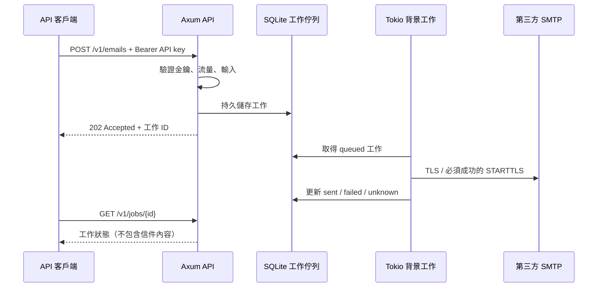

# Courier Hub

[English](README.md) | **繁體中文**

用 Rust、Axum、Tokio 實作的 REST API 非同步轉送服務，目前支援透過第三方 SMTP 寄送純文字 email。可使用 Gmail 或自有網域信箱的 SMTP 主機；本服務不自行架設郵件伺服器，也不接收 SMTP 來信。

## 服務流程



`202` 代表工作已存入佇列，尚未寄出。`sent` 代表 SMTP 主機接受了郵件，不代表最終進入收件匣；退信、垃圾信判定與收件匣投遞由郵件供應商處理。

## 你需要知道的 Rust 概念

有其他開發經驗即可先用起來，不必先熟悉整個 Rust 語言。

| 概念 | 在本專案的用途 | 類似熟悉的概念 |
| --- | --- | --- |
| `struct` | `Email`、`Config` 等資料結構 | DTO / class 的資料部分 |
| `trait` | `DeliveryTransport` 定義寄送介面 | interface / protocol |
| `impl` | `SmtpTransport` 實作寄送介面 | implements interface |
| `async` / `.await` | 網路與資料庫操作等待時不阻塞執行緒 | async / await |
| `Result<T, E>` | 成功值或錯誤，呼叫端必須處理 | 可辨識的 success/error union |
| `Arc` | 多個 API 請求與背景工作共享資源 | 有引用計數的共享物件 |
| `Send + Sync` | 確保轉送實作能安全地跨執行緒使用 | 執行緒安全的介面契約 |
| Cargo | 管理依賴、建置、測試與工具 | npm / dotnet CLI / Maven |

Trait 能將背景工作與 SMTP 細節解耦。目前 `DeliveryTransport::deliver` 的輸入刻意是有型別的 `Email`，可以替換其他 email 供應商，也能用假的實作測試。日後增加 webhook、檔案轉送等不同資料模型時，再新增對應 DTO、API 路由與版本化工作格式；Trait 不會自動讓所有任意資料都適合相同介面。

## 快速開始

### 1. 安裝與建置

使用 [Rust 官方安裝程式](https://rust-lang.org/tools/install/)，Rust 版本至少 1.88。Windows 使用 MSVC 工具鏈並安裝 Visual Studio 的「使用 C++ 的桌面開發」Build Tools；Linux/macOS 需有 C/C++ 編譯器。本專案使用 rustls，不需要另裝 OpenSSL；SQLite 隨 Rust 依賴編譯。`rust-toolchain.toml` 指定 1.88.0，rustup 會在需要時下載該版本與 fmt/Clippy，不改動其他專案的預設工具鏈。

```sh
cargo build --locked
```

`Cargo.lock` 必須保留在 Git 中，讓不同機器使用相同依賴版本。它不是帳密檔案。

### 2. 建立私人設定

Windows PowerShell：

```powershell
Copy-Item .env.example .env
$keyBytes = New-Object byte[] 32
$rng = [System.Security.Cryptography.RandomNumberGenerator]::Create()
$rng.GetBytes($keyBytes)
$rng.Dispose()
$apiKey = [BitConverter]::ToString($keyBytes).Replace('-', '').ToLowerInvariant()
# 只在本機顯示，將這個值填入 .env 的 API_KEY。
$apiKey
notepad .env
```

Linux/macOS：

```sh
cp .env.example .env
chmod 600 .env
# 將輸出填入 .env 的 API_KEY。
openssl rand -hex 32
```

填好 `API_KEY`、`SMTP_HOST`、`SMTP_USERNAME`、`SMTP_PASSWORD`、`SMTP_FROM`。範本不是可直接使用的帳號，API key 的 `REPLACE_` 佔位值會被拒絕。密碼含特殊字元時請按 dotenv 格式加引號。請勿將 `.env` 內容貼進 issue、聊天、截圖或 CI 紀錄。

僅讀取目前工作目錄的 `.env`，不向上搜尋；已存在的程序環境變數優先。正式環境可完全不放 `.env`，由服務管理工具或 secret manager 注入環境變數。

### 3. 啟動

```sh
cargo run --locked
```

預設只監聽 `127.0.0.1:8080`。正式部署使用 `cargo build --release --locked`，Windows 執行 `target/release/courier-hub.exe`；Linux/macOS 執行 `target/release/courier-hub`。每個平台各自建置，不能拿 Windows exe 直接在 Linux 執行。

Windows/Linux/macOS 的 GitHub Actions 測試矩陣已設定；本次本機驗證環境為 Windows。啟動時會建立私人 `data/` 目錄與 SQLite 資料庫，Ctrl+C 停止接新工作並等待目前寄送完成；Unix 也處理 SIGTERM。

### 4. 呼叫 API

在另一個 PowerShell 視窗使用同一把金鑰。可沿用前面 `$apiKey` 的值，或在客戶端自己的私人環境變數中設定 `COURIER_API_KEY`。服務讀入 `.env` 不會替另一個視窗設定環境變數。

```powershell
$apiKey = $env:COURIER_API_KEY
$headers = @{
    Authorization = "Bearer $apiKey"
    'Idempotency-Key' = [Guid]::NewGuid().ToString()
}
$body = @{
    to = @('recipient@example.com')
    subject = '測試非同步寄信'
    text = '這封信由 Courier Hub 轉送。'
} | ConvertTo-Json
$job = Invoke-RestMethod -Method Post -Uri 'http://127.0.0.1:8080/v1/emails' `
    -Headers $headers -ContentType 'application/json; charset=utf-8' `
    -Body ([System.Text.Encoding]::UTF8.GetBytes($body))
$job
Invoke-RestMethod -Uri "http://127.0.0.1:8080/v1/jobs/$($job.id)" -Headers $headers
```

Linux/macOS（`COURIER_API_KEY` 由客戶端的私人設定提供）：

```sh
curl -i http://127.0.0.1:8080/v1/emails \
  -H "Authorization: Bearer $COURIER_API_KEY" \
  -H 'Content-Type: application/json' \
  -H 'Idempotency-Key: example-request-001' \
  --data '{"to":["recipient@example.com"],"subject":"Hello","text":"Hello from Courier Hub"}'

curl http://127.0.0.1:8080/v1/jobs/WORK_ID \
  -H "Authorization: Bearer $COURIER_API_KEY"
```

每個新工作使用新的 `Idempotency-Key`；同一工作遇到網路錯誤重送時，保留原本的 key 與相同 JSON 欄位內容。上面固定 key 僅供示範。

## SMTP 設定

### Gmail

```dotenv
SMTP_HOST=smtp.gmail.com
SMTP_PORT=587
SMTP_TLS=starttls
SMTP_USERNAME=your-account@gmail.com
SMTP_PASSWORD=REPLACE_WITH_GOOGLE_APP_PASSWORD
SMTP_FROM=your-account@gmail.com
```

使用有權限寄信的帳號，以及 Google 的應用程式密碼；不要填 Google 登入密碼。Google 的應用程式密碼需要啟用兩步驟驗證，且部分組織帳號、安全金鑰設定或進階保護帳號可能無法使用。變更 Google 密碼後可能需重新建立應用程式密碼。參考 [Google 官方說明](https://support.google.com/accounts/answer/185833)。

本版支援 SMTP 帳號／密碼驗證，尚未實作 OAuth2；若帳號政策要求 OAuth2，這版不能直接使用該帳號，可選擇允許 SMTP 應用程式密碼的供應商，或日後新增 OAuth2 adapter。

### 自有網域信箱

```dotenv
SMTP_HOST=smtp.your-mail-provider.example
SMTP_PORT=465
SMTP_TLS=implicit
SMTP_USERNAME=notifications@your-domain.example
SMTP_PASSWORD=REPLACE_WITH_PROVIDER_SMTP_PASSWORD
SMTP_FROM=notifications@your-domain.example
```

自有 domain 本身不提供寄信服務；請使用購買的郵件代管服務所指定的 SMTP 主機、驗證方式與寄件地址。以供應商後台公布的值為準。若供應商要求 587／STARTTLS，改用 `SMTP_TLS=starttls`。`SMTP_FROM` 固定由伺服器設定，API 呼叫端不能自行偽造寄件人。

`starttls` 必須成功升級成 TLS 才會傳送帳密與信件；`implicit` 從連線開始即使用 TLS。兩者都驗證主機名稱與公開 CA 憑證，不支援關閉憑證驗證或明文 SMTP。行為依據 [lettre 官方文件](https://docs.rs/lettre/latest/lettre/transport/smtp/struct.AsyncSmtpTransport.html)。

## API 契約

完整規格見 [docs/openapi.yaml](docs/openapi.yaml)，可匯入支援 OpenAPI 3.0 的工具。

| Method | 路徑 | 用途 | 驗證 |
| --- | --- | --- | --- |
| GET | `/healthz` | 檢查 API 與資料庫可用性，不測 SMTP | 無 |
| POST | `/v1/emails` | 提交 email，成功回傳 202、工作 ID 與 Location | Bearer API key |
| GET | `/v1/jobs/{id}` | 查詢工作狀態 | Bearer API key |

提交 JSON 只允許 `to`、`subject`、`text`，不接受多餘欄位。目前不提供附件、HTML、CC/BCC 或接收郵件功能。

| 欄位 | 限制 |
| --- | --- |
| `to` | 1～10 個裸 email 地址，每個最多 254 bytes；不接受顯示名稱 |
| `subject` | 非空白、最多 998 bytes；拒絕控制字元（含 CR/LF） |
| `text` | 非空白、最多 48 KiB；拒絕 NUL |
| HTTP JSON | 最多 64 KiB，含 JSON 編碼開銷 |
| `Idempotency-Key` | 可選，1～128 ASCII 字元；只允許英數及 `-_.:` |

時間欄位 `created_at`／`updated_at` 為 UTC Unix 秒。工作 JSON：

```json
{
  "id": "38af9c6e-930c-4d71-8f6c-7ee385bc84c8",
  "status": "queued",
  "created_at": 1791504000,
  "updated_at": 1791504000,
  "error_code": null
}
```

| 狀態 | 意義 |
| --- | --- |
| `queued` | 已持久儲存，等待背景工作 |
| `sending` | 正在向 SMTP 送出 |
| `sent` | SMTP 已接受 |
| `failed` | 明確 SMTP 拒絕（`smtp_rejected`），或本機信件建構失敗（`invalid_message`） |
| `unknown` | 無法確定 SMTP 是否接受（`delivery_uncertain`），或重啟時發現未完成的寄送（`interrupted`） |

同 key、同內容回傳原工作（即使已完成仍回 202）；同 key、不同內容回 409。工作過期清除後 key 也過期，因此去重只在保留期間有效。未提供 key 的重複 POST 會建立不同工作。

其他狀態碼：400 無效 key/工作 ID/JSON、401 金鑰錯誤、404 工作不存在或已過期、405 method 錯誤、413 request 過大、415 Content-Type 錯誤、422 欄位錯誤、429 流量上限、503 佇列已滿或健康檢查失敗。請求逾時回 408，資料庫異常回 500。錯誤格式：

```json
{"error":{"code":"unauthorized","message":"valid Bearer API key required"}}
```

## 設定項目

| 環境變數 | 預設／範圍 |
| --- | --- |
| `API_KEY` | 必填，32～256 個可列印且無空白的 ASCII 字元；建議產生 32 random bytes 的 hex 值 |
| `BIND_ADDR` | `127.0.0.1:8080`，IP:port |
| `DATA_DIR` | `data`，私人本機資料目錄 |
| `SMTP_HOST` | 必填，SMTP DNS hostname |
| `SMTP_PORT` | STARTTLS 預設 587，implicit 預設 465；1～65535 |
| `SMTP_TLS` | `starttls` 或 `implicit` |
| `SMTP_USERNAME` / `SMTP_PASSWORD` | 必填，不透過 API 傳入 |
| `SMTP_FROM` | 必填，可為裸地址或 `Courier Hub <sender@example.com>` |
| `SMTP_TIMEOUT_SECONDS` | 30，1～120；同時限制 SMTP 命令與整次寄送 |
| `WORKER_CONCURRENCY` | 2，1～16 |
| `MAX_PENDING_JOBS` | 1000，1～100000；包含 queued + sending |
| `REQUESTS_PER_MINUTE` | 120，1～100000；單一 API key 的全服務 token bucket，初始可突發同等數量，之後持續補充 |
| `JOB_RETENTION_HOURS` | 24，1～720；完成後的狀態/key 保留時間，啟動時及每分鐘清除 |
| `ALLOWED_RECIPIENT_DOMAINS` | 空字串允許所有網域；可填逗號分隔的精確網域，不包含子網域 |

查詢與提交共用流量預算，`healthz` 不計入。SMTP 帳密與 API key 變更後需重啟程序。

## 安全與資料隱私

- API key 必填，使用雜湊及固定時間比較驗證；所有工作提交與查詢都需驗證。
- 預設只開本機介面。需要讓其他機器連線時，在 HTTPS 反向代理／API gateway 後部署，再依部署環境調整 `BIND_ADDR`。程式本身提供 HTTP，SMTP TLS 不會替 HTTP API 加密。
- HTTP body、文字內容、收件人數、佇列與寄送併發都有上限；每把 key 也有限流。公開入口另外由 gateway 控制連線與未驗證流量，應用層限流不是 DDoS 防護。
- 不開放 CORS；瀏覽器若需要跨來源呼叫，應另建經過驗證的後端代理。不要把 API key 放進公開前端。
- API 不接受 SMTP host、帳密、寄件人或任意轉送 URL；避免讓呼叫端決定內部網路目的地。需要限制可寄送對象時設定 `ALLOWED_RECIPIENT_DOMAINS`。
- 應用程式只記錄工作 ID、狀態與通用錯誤，不記錄金鑰、SMTP 帳密、地址、主旨、內文或供應商原始錯誤。
- SQLite 必須持久儲存尚未寄送的地址、主旨及內文，目前為明文磁碟資料。終止狀態會將 payload 設成 NULL；這不是實體安全抹除，WAL、磁碟殘留及備份仍可能保存舊資料。需要磁碟／備份加密時由部署環境提供。
- Unix 的資料庫和 lock 檔限制成 0600；Windows 使用資料夾既有 ACL，部署時僅給服務帳號必要權限。`.env`、資料目錄和備份都應限制檔案權限。
- `.gitignore` 已排除 `.env`、`.env.*`（保留無秘密的 `.env.example`）、`data/`、SQLite/WAL、金鑰憑證與 log。自訂資料路徑放在專案外，或另外加入 ignore。
- `.gitignore` 不會移除已追蹤的秘密，也不會阻止 `git add -f`。這是新專案，沒有納入真實帳密；若未來秘密被提交，先撤銷／輪替，再處理 Git 歷史。

提交前可驗證：

```sh
git check-ignore .env .env.production data/courier.db data/courier.db-wal
git status --short
```

本版為單程序、單 SMTP 設定、單 API key 服務，不提供多租戶權限。相同 `DATA_DIR` 有跨平台檔案鎖，不能同時啟動兩個實例；SQLite 請使用本機持久磁碟。要水平擴展時再換成共享資料庫／訊息佇列與租約機制。

SMTP 不提供端到端 exactly-once 保證。本版不自動重試寄送，連明確拒絕都先留給使用者決定；`unknown` 先核對供應商寄送紀錄再決定是否用新的 key 重送。穩定的 Message-ID 可供查核，但不保證供應商去重。

## 部署到 Ubuntu VPS

以下流程以 Ubuntu 24.04 LTS 與 systemd 為目標。指令應在 VPS 的 Bash／SSH 工作階段內，以有 `sudo` 權限的一般管理帳號執行，不是在本機 Windows PowerShell 執行。在 VPS 上建置，可符合該機器的 CPU 架構與 Linux 函式庫；編譯時可能需要比執行服務更多的記憶體或 swap。

部署架構為：**Internet → Nginx HTTPS :443 → Courier Hub 127.0.0.1:8080 → 第三方 SMTP**。systemd 負責開機啟動，以及程序失敗後重新啟動。

| 路徑 | 用途 |
| --- | --- |
| `~/courier-hub` | 原始碼，由一般管理帳號持有 |
| `/opt/courier-hub/courier-hub` | release 執行檔，由 root 持有 |
| `/etc/courier-hub/service.env` | 私人設定檔，由 root 持有，權限 0600 |
| `/var/lib/courier-hub` | SQLite 工作資料，由服務帳號持有，權限 0700 |
| `/etc/systemd/system/courier-hub.service` | 服務單元設定 |
| `/etc/nginx/sites-available/courier-hub` | 對外 HTTPS 反向代理設定 |

兩種語言共用 [deploy/ubuntu](deploy/ubuntu) 中不含秘密的範本。以下是操作說明，不會從開發電腦自動部署到你的 VPS。

### 1. 準備 DNS、套件與防火牆

將 API 網域（例如 `api.example.com`）的 DNS A 紀錄指向 VPS 公開 IP。只有伺服器確實能使用公開 IPv6 時才加入 AAAA 紀錄。第一次申請憑證時，DNS 與 CDN／代理必須讓 ACME 驗證路徑的 HTTP 請求到達 VPS。將下方的 `api.example.com` 改成自己的網域，並在同一個 Bash 工作階段完成部署。

```sh
# 從自己的電腦連線；替換帳號與 IP。
ssh ubuntu@VPS_IP

# 以下指令在 Ubuntu 執行。
api_domain=api.example.com
sudo apt update
sudo apt install -y build-essential curl git ca-certificates pkg-config nginx ufw snapd openssl

# 啟用 UFW 前，先放行實際使用的 SSH 連接埠。
sudo ufw allow OpenSSH
sudo ufw allow 80/tcp
sudo ufw allow 443/tcp
sudo ufw enable
sudo ufw status
```

若 SSH 不是使用 22，啟用防火牆前先放行正確連接埠，並確認第二個 SSH 連線可成功登入。VPS 供應商的防火牆也要開放對應的 inbound 規則。不要開放 8080 對外連線。VPS 另外需要能向郵件供應商的 SMTP submission 連接埠（通常 587 或 465）建立 outbound 連線；失敗時確認供應商是否限制 SMTP。UFW 操作依據 [Ubuntu 防火牆文件](https://ubuntu.com/server/docs/how-to/security/firewalls/)。

### 2. 建置 Linux 執行檔

```sh
rustup_script=$(mktemp)
curl --proto '=https' --tlsv1.2 -sSf https://sh.rustup.rs -o "$rustup_script"
sh "$rustup_script" -y --profile minimal --default-toolchain 1.88.0
rm -f "$rustup_script"
. "$HOME/.cargo/env"

git clone https://github.com/rojarsmith/courier-hub.git "$HOME/courier-hub"
cd "$HOME/courier-hub"
cargo build --release --locked
```

若 repository 是 private，先在 VPS 設定專用、唯讀的 [GitHub deploy key](https://docs.github.com/en/authentication/connecting-to-github-with-ssh/managing-deploy-keys)，再將 clone URL 改成 `git@github.com:rojarsmith/courier-hub.git`。私鑰放在 checkout 之外。實際執行服務的帳號不需要 GitHub 私鑰或 Rust 編譯器。Rust 安裝方式見 [官方說明](https://rust-lang.org/tools/install/)。

### 3. 安裝執行檔與私人設定

在原始碼目錄執行。以下建立帳號與安裝設定的指令適用於第一次部署；之後更新請使用下方的更新流程。

```sh
sudo useradd --system --user-group --no-create-home --shell /usr/sbin/nologin courier-hub
sudo install -d -o root -g root -m 755 /opt/courier-hub
sudo install -o root -g root -m 755 target/release/courier-hub /opt/courier-hub/courier-hub
sudo install -d -o root -g root -m 700 /etc/courier-hub
sudo install -o root -g root -m 600 deploy/ubuntu/.env.example /etc/courier-hub/service.env
openssl rand -hex 32
sudo nano /etc/courier-hub/service.env
```

將產生的值填入 `API_KEY`，並替換所有 SMTP 帳號佔位值。保留 `BIND_ADDR=127.0.0.1:8080` 與 `DATA_DIR=/var/lib/courier-hub`。私人設定檔在 Git 之外，不要將內容寫進部署腳本或 commit。Gmail 應用程式密碼與自有網域信箱設定請參考前面的 SMTP 章節。

此檔案使用 systemd `EnvironmentFile` 格式：每行 `KEY=value`，不加 `export`，也不做指令替換或變數展開。含空格的值要加引號，例如 `SMTP_FROM="Courier Hub <sender@example.com>"`。systemd 會在啟動低權限程序之前讀取 root 專用檔案；不要在 shell 中 `source` 它。本部署方式透過環境變數注入設定，不需要建立 `/opt/courier-hub/.env`。

### 4. 啟動 systemd 服務

```sh
sudo install -o root -g root -m 644 deploy/ubuntu/courier-hub.service /etc/systemd/system/courier-hub.service
sudo systemd-analyze verify /etc/systemd/system/courier-hub.service
sudo systemctl daemon-reload
sudo systemctl enable --now courier-hub
sudo systemctl status courier-hub --no-pager
curl --fail --silent --show-error http://127.0.0.1:8080/healthz
```

[服務範本](deploy/ubuntu/courier-hub.service) 會建立私人資料目錄、將檔案寫入限制在該目錄與私人暫存空間，並以 `courier-hub` 帳號執行。停止逾時設為 150 秒，讓應用程式最長 120 秒的 SMTP 嘗試有時間結束。`/healthz` 應回傳 `{"status":"ok"}`；它只檢查 API／資料庫，不會驗證 SMTP 帳密。環境變數與檔案系統選項見 [systemd 文件](https://github.com/systemd/systemd/blob/v255/man/systemd.exec.xml)。

### 5. 取得憑證後啟用 HTTPS

先安裝 [HTTP 初始化範本](deploy/ubuntu/nginx-http.conf)。這個範本只提供 ACME 驗證檔案，其餘請求轉向 HTTPS，因此在申請憑證期間不會透過明文 HTTP 開放 API。

```sh
sudo install -d -o root -g root -m 755 /var/www/certbot
sed "s/api\.example\.com/$api_domain/g" deploy/ubuntu/nginx-http.conf | sudo tee /etc/nginx/sites-available/courier-hub > /dev/null
sudo ln -s /etc/nginx/sites-available/courier-hub /etc/nginx/sites-enabled/courier-hub
sudo nginx -t
sudo systemctl enable --now nginx
sudo systemctl reload nginx

sudo snap install --classic certbot
sudo /snap/bin/certbot certonly --webroot -w /var/www/certbot --cert-name "$api_domain" -d "$api_domain"
```

完成 Certbot 的 email 與服務條款提示，只有成功取得憑證後才繼續。HTTP-01 驗證需要正確 DNS 與 inbound 80；參考 [Ubuntu TLS 文件](https://ubuntu.com/server/docs/how-to/security/obtain-tls-certificates/) 與 [Certbot 安裝說明](https://certbot.eff.org/instructions?ws=nginx&os=snap)。

接著安裝 [HTTPS 範本](deploy/ubuntu/nginx.conf)，替換 server name 與憑證路徑中的網域：

```sh
sed "s/api\.example\.com/$api_domain/g" deploy/ubuntu/nginx.conf | sudo tee /etc/nginx/sites-available/courier-hub > /dev/null
sudo nginx -t
sudo systemctl reload nginx
curl --fail --silent --show-error "https://$api_domain/healthz"

sudo install -d -o root -g root -m 755 /etc/letsencrypt/renewal-hooks/deploy
sudo install -o root -g root -m 755 deploy/ubuntu/reload-nginx.sh /etc/letsencrypt/renewal-hooks/deploy/courier-hub-nginx
sudo /snap/bin/certbot renew --dry-run --run-deploy-hooks
systemctl list-timers --all
```

確認排程中有 Certbot 的自動續期 timer。deploy hook 會在憑證續期後檢查並 reload Nginx，dry run 也會測試該 hook。續期時仍需保留 HTTP ACME 路徑與 80 連接埠；參考 [Certbot 續期文件](https://eff-certbot.readthedocs.io/en/stable/using.html#renewing-certificates)。

HTTPS 範本會轉送驗證 header、將 request body 限制為 64 KiB、關閉 upstream 重試，並加入每 IP 每秒 10 個請求、突發 20 個的入口限流。多個客戶端共用 NAT IP 時請依流量調整；應用程式的 API key 流量上限仍然生效。設定依據 [Nginx 反向代理](https://nginx.org/en/docs/http/ngx_http_proxy_module.html) 與 [限流](https://nginx.org/en/docs/http/ngx_http_limit_req_module.html) 文件。呼叫 API 時直接使用 `https://` URL；轉址無法保護已經透過 HTTP 傳出的金鑰。

### 6. 驗證權限與實際寄送

先確認未提供金鑰的提交回傳 401：

```sh
curl -i "https://$api_domain/v1/emails" -H 'Content-Type: application/json' --data '{}'
```

接著將收件人改成自己擁有的測試信箱。此 Bash 範例讀取金鑰時不回顯，並透過 stdin 傳遞驗證 header，不將金鑰放在指令列參數中：

```sh
read -r -s -p 'API key: ' courier_api_key
printf '\n'
request_id=$(cat /proc/sys/kernel/random/uuid)
printf 'Authorization: Bearer %s\n' "$courier_api_key" | curl --silent --show-error --fail-with-body \
  --header @- --header 'Content-Type: application/json' \
  --header "Idempotency-Key: $request_id" \
  --data '{"to":["recipient@example.com"],"subject":"VPS delivery test","text":"Hello from Courier Hub on Ubuntu."}' \
  "https://$api_domain/v1/emails"

read -r -p 'Job ID from the response: ' job_id
printf 'Authorization: Bearer %s\n' "$courier_api_key" | curl --fail --silent --show-error \
  --header @- "https://$api_domain/v1/jobs/$job_id"
unset courier_api_key
```

提交應回傳 202，再查詢到 `sent`、`failed` 或 `unknown`。因連線錯誤重送同一份內容時，保留 `$request_id`。`unknown` 工作要先查核 SMTP 紀錄再決定是否重送。帶有帳密時不要使用 verbose curl，也不要將金鑰放在 URL。

### 7. 備份、更新與回復

要取得一致的離線 SQLite 備份，先停止服務，再封存整個資料目錄，包含可能存在的 WAL 檔案。以下會短暫中斷服務；即使封存失敗，也要執行最後的 start 指令。

```sh
sudo install -d -o root -g root -m 700 /var/backups/courier-hub
backup_archive="/var/backups/courier-hub/jobs-$(date -u +%Y%m%dT%H%M%SZ).tar.gz"
sudo systemctl stop courier-hub
sudo tar -C /var/lib -czf "$backup_archive" courier-hub
sudo chmod 600 "$backup_archive"
sudo systemctl start courier-hub
```

備份含信件內容，請限制存取並按需求加密；`/etc/courier-hub/service.env` 另外備份到私人的 secret store。不要只複製使用中的資料庫單一檔案。

以一般管理帳號建置更新，期間讓既有服務繼續運作，再優雅停止並替換執行檔：

```sh
cd "$HOME/courier-hub"
git pull --ff-only origin main
cargo test --locked --all-targets
cargo build --release --locked
sudo install -o root -g root -m 755 target/release/courier-hub /opt/courier-hub/courier-hub.new
sudo cp -p /opt/courier-hub/courier-hub /opt/courier-hub/courier-hub.previous
sudo systemctl stop courier-hub
sudo mv /opt/courier-hub/courier-hub.new /opt/courier-hub/courier-hub
sudo systemctl start courier-hub
curl --fail --silent --show-error http://127.0.0.1:8080/healthz
```

若新執行檔失敗，還原上一版：

```sh
sudo systemctl stop courier-hub
sudo cp -p /opt/courier-hub/courier-hub.previous /opt/courier-hub/courier-hub.new
sudo mv /opt/courier-hub/courier-hub.new /opt/courier-hub/courier-hub
sudo systemctl reset-failed courier-hub
sudo systemctl start courier-hub
```

更新時保留私人設定與資料目錄。unit／proxy 範本若有修改，另外審閱後再重新安裝；編輯 unit 後執行 `daemon-reload`。修改 `service.env` 需要重啟服務。執行檔回復不會逆轉未來可能的資料庫 schema 變更，因此升級前先備份資料。同一個資料目錄只執行一個服務實例。

### 故障排查

```sh
sudo journalctl -u courier-hub -n 100 --no-pager
sudo nginx -t
sudo tail -n 50 /var/log/nginx/courier-hub.error.log
sudo ss -ltnp
```

| 現象 | 檢查項目 |
| --- | --- |
| 服務啟動失敗 | API key 未填或仍是佔位值、SMTP 設定、root 持有的執行檔、私人設定格式或資料目錄權限。修正重複失敗原因後，執行 `sudo systemctl reset-failed courier-hub` 再啟動。 |
| Nginx 回傳 502 | 檢查 systemd 與 `curl http://127.0.0.1:8080/healthz`；服務與代理需使用相同的 8080 連接埠。 |
| 憑證申請／續期失敗 | 檢查 A／AAAA、兩層防火牆的 80 連接埠、ACME webroot 與 CDN 路由。 |
| 工作為 failed／unknown | 檢查供應商驗證政策、應用程式密碼、TLS 模式與 outbound SMTP 限制；`/healthz` 不測試 SMTP。 |
| 請求回傳 413／429 | 檢查代理的 body／每 IP 限流，以及 API 本身的 body／key 上限。 |
| 建置時記憶體不足 | 使用 `cargo build --release --locked -j 1` 降低並行數，並檢查 RAM／swap。 |

不傳送帳密的 Gmail STARTTLS 連線檢查：

```sh
openssl s_client -starttls smtp -connect smtp.gmail.com:587 -servername smtp.gmail.com -verify_return_error < /dev/null
```

使用自己的郵件供應商主機名稱替換範例。若使用 465 implicit TLS，移除 `-starttls smtp` 並更換連接埠。網域、憑證、SMTP 帳號與 VPS 防火牆需在實際伺服器驗證；開發環境無法確認你的 VPS 已成功部署。

## 開發與驗證

```sh
cargo fmt --all -- --check
cargo test --locked --all-targets
cargo clippy --locked --all-targets -- -D warnings
cargo build --locked --release
```

測試使用暫存 SQLite、假的轉送介面和本機 TLS SMTP 模擬端點，不需要真實帳密，也不向外寄信。涵蓋驗證／限流、輸入注入、佇列滿載、併發去重、重啟、狀態隱私、保留期限、SMTP 成功／拒絕與拒絕 TLS 降級。真正供應商的帳號權限、配額與投遞狀況仍需在填入私人設定後用自己的測試信箱驗證。

CI 在三個平台做編譯、測試、fmt 和 Clippy，另以 RustSec 的 cargo-audit 檢查公開依賴弱點。這些檢查不需要儲存 SMTP secret。

| 檔案 | 責任 |
| --- | --- |
| `src/main.rs` | 啟動、背景工作、關閉程序 |
| `src/config.rs` | 私人環境設定與啟動驗證 |
| `src/api.rs` | HTTP 路由、驗證、限流與錯誤回應 |
| `src/model.rs` | email/job 資料契約與驗證 |
| `src/store.rs` | SQLite 持久工作、容量與去重 |
| `src/transport.rs` | Trait 與 SMTP adapter |
| `src/worker.rs` | 非同步工作執行與寄送逾時 |
| `tests/service.rs` | 不依賴外部供應商的服務測試 |
